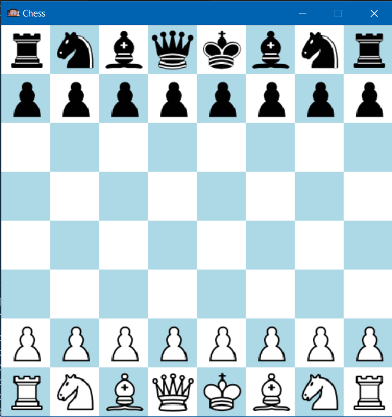

## How to start project
* step 1: Make sure that python is installed on your machine
* step 2: Install pygame library: `pip install pygame`
* step 3: `git clone <repo_url> `
* step 4: `cd <clone_repository> `
* step 5: open `main.py` file and run file in terminal

### Project Chess 
We have to design simple chess game. Chess is actually a very popular game. You can read more about it online on wikipedia

##Diagram

 
#### Project Entities
If you have already played it already then you might already know this. But to ensure that we all are on the same page, I am defining some here:
* Board: Board is the one entity represents an actual board on which which you play this game.
* Cell: A board consists of a grid of cells.
* Player: Someone who is actually playing right.
* Piece: There are various types of pieces as explained below.

#### Pieces and their moves:
* King: Key entity in chess. If your king is killed then you lose. Its also called checkmate.
* Queen: It can move any number of steps in a single move and in any direction.
* Rook: It only moves in horizontal and vertical direction but can move any number of steps in single move.
* Bishop: It only moves in diagonal direction but can move any number of steps in single move.
* Knight: It makes L shaped moves. Check online for more details about it.
* Pawn: It can move 1 step forward vertically. If it is its first turn, then it can also choose to make 2 steps in single move.  

